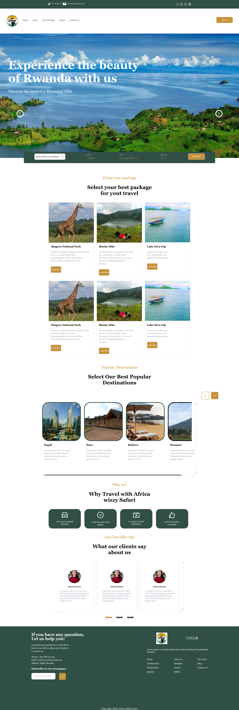

# React + Vite

This template provides a minimal setup to get React working in Vite with HMR and some ESLint rules.

Currently, two official plugins are available:

- [@vitejs/plugin-react](https://github.com/vitejs/vite-plugin-react/blob/main/packages/plugin-react) uses [Babel](https://babeljs.io/) (or [oxc](https://oxc.rs) when used in [rolldown-vite](https://vite.dev/guide/rolldown)) for Fast Refresh
- [@vitejs/plugin-react-swc](https://github.com/vitejs/vite-plugin-react/blob/main/packages/plugin-react-swc) uses [SWC](https://swc.rs/) for Fast Refresh

## React Compiler

The React Compiler is not enabled on this template because of its impact on dev & build performances. To add it, see [this documentation](https://react.dev/learn/react-compiler/installation).

## Expanding the ESLint configuration

If you are developing a production application, we recommend using TypeScript with type-aware lint rules enabled. Check out the [TS template](https://github.com/vitejs/vite/tree/main/packages/create-vite/template-react-ts) for information on how to integrate TypeScript and [`typescript-eslint`](https://typescript-eslint.io) in your project.

## PROJECT NAME
-Tourist Site  Template

## PROJECT PREVIEW
 ()
 

## PROJECT DESCRIPTIOM
-this project is a simple tourist site template the was built with the use of react.js, html and css
-It is just on a template with 5 pages show all the components involved in building at least a good toursit site webpage

# PROJECT TECHNICALLITY
-This Project made us of HTML, CSS, JavaScript and ReactJs Library

## Prerequisite

-Data structure
-Components reuseal in ReactJs
-Navigation

## Demo Link
https://tourist-site-template-e9c5-git-development-nyapbless-projects.vercel.app/
https://github.com/nyapblesso-a11y/tourist-site-template/pull/1
## About Author
GitHub: https://github.com/nyapblesso-a11y
linkedIn: https://www.linkedin.com/in/nyap-bless-ringnyu-59b414384/edit/intro/?profileFormEntryPoint=PROFILE_SECTION&lipi=urn%3Ali%3Apage%3Ad_flagship3_profile_view_base%3Btr8UFhE4Rdy8NH03m0QnmA%3D%3D
